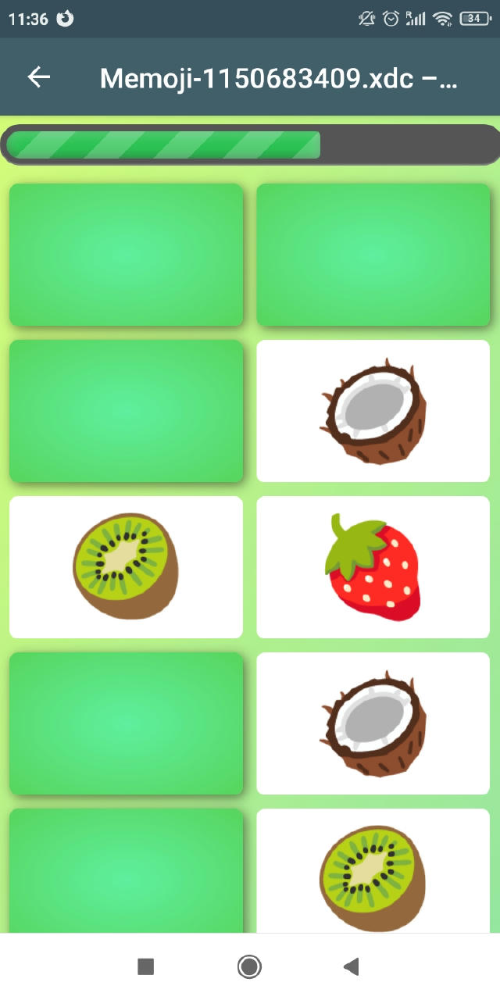
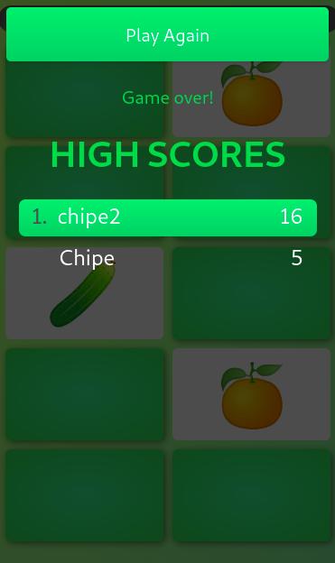

# MEMOJI
This is a classic memory game with emoji cards. Try to match as many pairs of flipped cards as you can in order to get more scores and play time. When the time is over you will get a highscores prompt. 

 



## Webxdc generation
To generate a ```.xdc``` file run:
```
./create-xdc.sh
```
You can attach the generated ```.xdc``` file to a DeltaChat conversation and play with your friends!